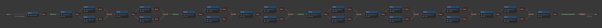
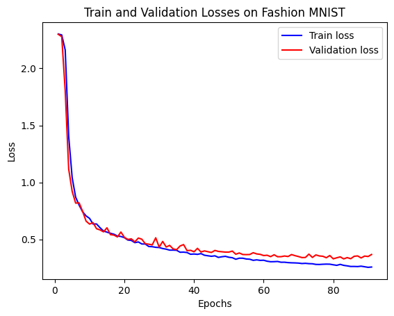
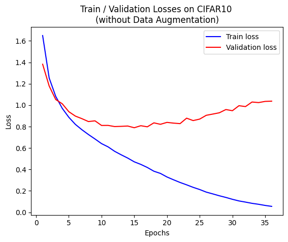
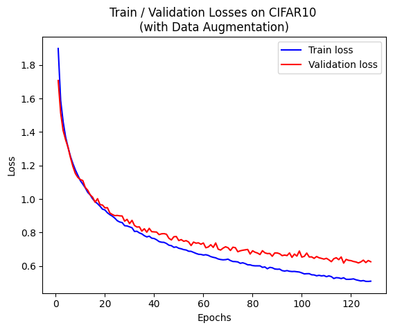

# AOC Lab 1

> 智慧運算碩士學位學程 NN6124030 施宇庭

## Q1 Convolution

假設 convolution 的 input feature map、output feature map 及 filter 的尺寸如下：

|   | Number | Channel| Height | Width |
| - | ------ | ------ | ------ | ----- |
| Input   | $N$ | $C$ | $H$ | $W$ |
| Filter  | $M$ | $C$ | $R$ | $S$ |
| Output  | $N$ | $M$ | $E$ | $F$ |

其中 output size 為：

$$
E = \frac{H + 2 \times \text{Pad} - \text{Dil} \times (R-1)-1}{\text{Str}} + 1
\ \\
\ \\
F = \frac{W + 2 \times \text{Pad} - \text{Dil} \times (S-1)-1}{\text{Str}} + 1
$$

若 padding = 0、stride = 1、dilation = 1，則 output size 可以簡化為：

$$
E = H - R + 1
\ \\
\ \\
F = W - S + 1
$$

在沒有 bias 的狀況下，每個 convolution layer 的參數量即為 filter size：

$$
\text{Params} = M \times C \times R \times S
$$

乘加運算 (MAC) 的數量則為：

$$
\text{MACs} = (N \times M \times E \times F) \times (C \times R \times S)
$$

因此 Conv 5x5 的參數量與乘加運算量為：

$$
\text{Params} = 5 \times 5 = 25
\ \\
\ \\
\text{MACs} = (28 \times 28) \times (5 \times 5) = 19600
$$

連續兩個 Conv 3x3 的參數量與乘加運算量則為：

$$
\text{Params} = (3 \times 3) + (3 \times 3) = 18
\ \\
\ \\
\text{MACs of 1st layer} = (30 \times 30) \times (3 \times 3) = 8100
\ \\
\ \\
\text{MACs of 2nd layer} = (28 \times 28) \times (3 \times 3) = 7056
\ \\
\ \\
\text{total MACs} = 8100 + 7056 = 15156
$$

總結如下，將大的 filter 拆成多個小 filters 可以減少參數及運算量：

|                             | Params | MACs |
| ---------------------------:|:------:|:----:|
|               `Conv 5x5x1`  | $25$   | $19600$ |
| `Conv 3x3x1` + `Conv 3x3x1` | $18$ | $15156$ |


## Q2 Model Architecture Visualization
<!-- Netron 視覺化並截圖 -->

### Fashion MNIST



### CIFAR10

## Q3 Training and Validation Losses
<!-- 畫出 train/validation loss，是否 overfit -->

### Fashion MNIST



### CIFAR10




## Q4  心得
<!-- 心得 -->

## Q5
<!-- 實作上做了什麼調整 (learning rate, image augmentation) 來維持準確度、減少參數及運算量、提高吞吐量、避免 overfitting？加上不同的 data augmentation 對 accuracy 有什麼影響？以具體的文字搭配數據描述 -->

### Q5-1 Training Optimization

### Q5-2 Data Augmenetation


選用 PyTorch 框架中有提供的模型架構，挑選參數量最小的，但要怎麼測量參數量與 MAC 數？

計算參數量：


```
================================================================
Total params: 351,610
Trainable params: 351,610
Non-trainable params: 0
----------------------------------------------------------------
Input size (MB): 0.00
Forward/backward pass size (MB): 0.47
Params size (MB): 1.34
Estimated Total Size (MB): 1.81
----------------------------------------------------------------
```

|   | Params | MACs | Test accuracy |
| - | - | - | - |
| Fashion MNIST | 0.390634 M | 0.007924224 G |  |
| CIFAR10       | 0.620586 M | 0.011078144 G | 0.8088 |

### Fashion MNIST

使用了
learning rate = 0.001
batch size = 512

baseline 使用 SGD optimizer
baseline 使用 ADAM optimizer
baseline 使用 SGD optimizer + data augmentation
