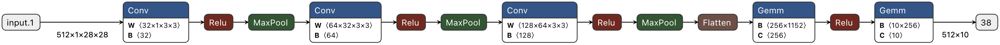
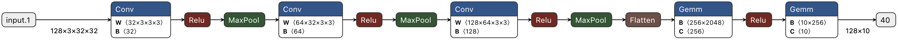
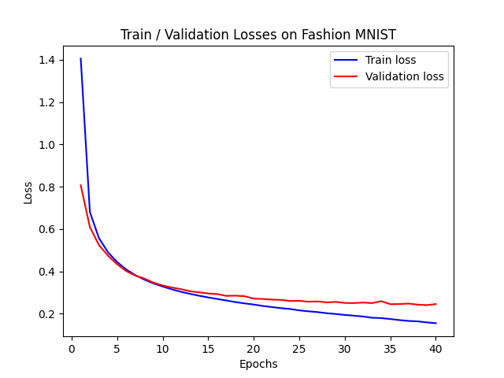
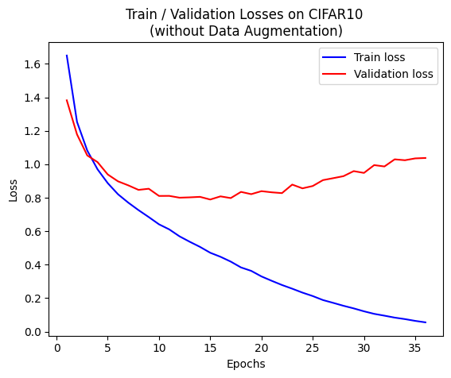
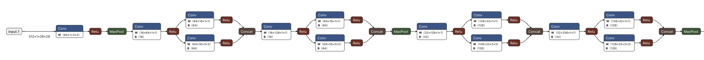
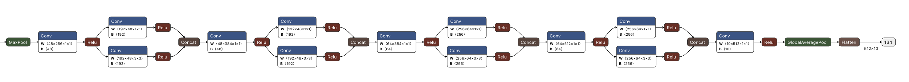
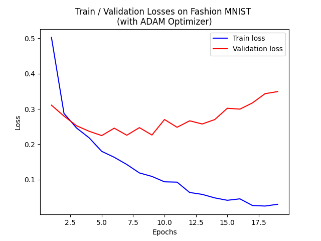
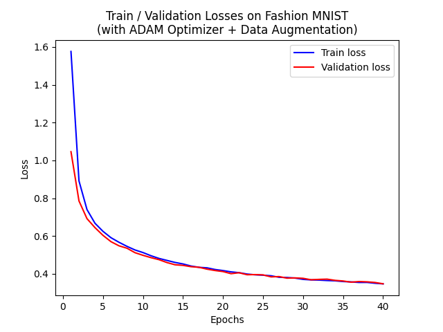

# AOC Lab 1

> 智慧運算碩士學位學程 NN6124030 施宇庭

## Q1 - Convolution

假設 convolution 的 input feature map、output feature map 及 filter 的尺寸如下：

|   | Number | Channel| Height | Width |
| - | ------ | ------ | ------ | ----- |
| Input   | $N$ | $C$ | $H$ | $W$ |
| Filter  | $M$ | $C$ | $R$ | $S$ |
| Output  | $N$ | $M$ | $E$ | $F$ |

其中 output size 為：

$$
E = \frac{H + 2 \times \text{Pad} - \text{Dil} \times (R-1)-1}{\text{Str}} + 1
\ \\
\ \\
F = \frac{W + 2 \times \text{Pad} - \text{Dil} \times (S-1)-1}{\text{Str}} + 1
$$

若 padding = 0、stride = 1、dilation = 1，則 output size 可以簡化為：

$$
E = H - R + 1
\ \\
\ \\
F = W - S + 1
$$

在沒有 bias 的狀況下，每個 convolution layer 的參數量即為 filter size：

$$
\text{Params} = M \times C \times R \times S
$$

乘加運算 (MAC) 的數量則為：

$$
\text{MACs} = (N \times M \times E \times F) \times (C \times R \times S)
$$

因此 Conv 5x5 的參數量與乘加運算量為：

$$
\text{Params} = 5 \times 5 = 25
\ \\
\ \\
\text{MACs} = (28 \times 28) \times (5 \times 5) = 19600
$$

連續兩個 Conv 3x3 的參數量與乘加運算量則為：

$$
\text{Params} = (3 \times 3) + (3 \times 3) = 18
\ \\
\ \\
\text{MACs of 1st layer} = (30 \times 30) \times (3 \times 3) = 8100
\ \\
\ \\
\text{MACs of 2nd layer} = (28 \times 28) \times (3 \times 3) = 7056
\ \\
\ \\
\text{total MACs} = 8100 + 7056 = 15156
$$

總結如下，將大的 filter 拆成多個小 filters 可以減少參數及運算量：

|                             | Params | MACs |
| ---------------------------:|:------:|:----:|
|               `Conv 5x5x1`  | $25$   | $19600$ |
| `Conv 3x3x1` + `Conv 3x3x1` | $18$ | $15156$ |

## Q2 - Model Architecture Visualization
<!-- Netron 視覺化並截圖 -->

### Fashion MNIST

### CIFAR10

## Q3 - Training and Validation Losses
<!-- 畫出 train/validation loss，是否 overfit -->

### Fashion MNIST

使用 SGD optimizer，以 batch size = 128 及 learning rate = 0.001 進行訓練，且並未對資料做 data augmentation，整個過程中 validation loss 都隨著 train loss 持續下降，因此可以推斷沒有發生 overfitting 的狀況。

### CIFAR10

使用 SGD optimizer，以 batch size = 128 及 learning rate = 0.001 進行訓練，很明顯發生了 overfitting 的狀況 (training loss 下降但 validation loss 上升)

下面在訓練之前多做了 data augmentation，讓訓練的過程更加穩定，且沒有發生 overfitting 的狀況，訓練了超過 100 epochs 以後，validation loss 仍未有明顯上升的趨勢

## Q4  心得
<!-- 覺得這個lab可以改進的地方以及你的心得 -->

在做這個 lab 的時候因為需要比較不同的參數 (如 batch size、learning rate、with/without data augmentation 等) 下訓練出來的模型表現，依照助教給的模板每次嘗試不同的參數就需要上下翻找，然後改一下 code，然後再跑訓練，紀錄好數據後，再重複改 code 跑訓練，整個流程很瑣碎不方便。因此我花了一些時間整理程式碼，把每個步驟改寫成獨立且參數化的 function，在用不同的參數跑實驗時，就可以集中在一個地方定義實驗的內容，也可以一口氣跑很多個實驗。另外，兩個任務的程式碼重複性很高，如果可以的話，希望未來可以將那些重複的地方獨立成一個 `.py` 檔，裡面定義各個步驟需要的 functions，並在 `.ipynb` 檔中做實驗。

## Q5
<!-- 實作上做了什麼調整 (learning rate, image augmentation) 來維持準確度、減少參數及運算量、提高吞吐量、避免 overfitting？加上不同的 data augmentation 對 accuracy 有什麼影響？以具體的文字搭配數據描述 -->

### 實驗參數與結果

|   | Optimizer | Learning rate | Batch size | Data augmentation | Params | MACs | Test accuracy |
| - | - | - | - | - | - | - | - |
| Fashion MNIST (SqueezeNet) | SGD  | 0.001 | 512 | No  | 0.726410M | 0.002720020G | 86 % |
| Fashion MNIST (Config 1)   | SGD  | 0.001 | 512 | No  | 0.390634M | 0.007924224G | 90 % |
| Fashion MNIST (Config 2)   | ADAM | 0.001 | 512 | No  | 0.390634M | 0.007924224G | 90 % |
| Fashion MNIST (Config 3)   | SGD  | 0.001 | 512 | Yes | 0.390634M | 0.007924224G | 88 % |
| Fashion MNIST (Config 4)   | ADAM | 0.001 | 512 | Yes | 0.390634M | 0.007924224G | 88 % |
| CIFAR10  (Config 1)        | SGD  | 0.001 | 128 | No  | 0.620586M | 0.011078144G | 73 % |
| CIFAR10  (Config 2)        | SGD  | 0.001 | 128 | Yes | 0.620586M | 0.011078144G | 80 % |

### 模型優化方法

#### 1. Fashion MNIST

原先在 Fashion MNIST 的任務中，我使用 [SqueezeNet 1.1](https://arxiv.org/abs/1602.07360)，可以經鬆達到 86% 的準確度，模型架構如下圖：

但因為模型的參數量太過龐大 (超過 0.7 M)，因此改用自己設計的 CNN (三層 convolution layers + 兩層 fully connected layers)，並嘗試使用不同的 optimizer (SGD 及 ADAM) 和 data augmentation 觀察對模型表現的影響。

使用 ADAM 在 Fashion MNIST 上的收斂速度比 SGD 快，但也容易發生 overfitting (train loss 持續下降但 validation loss 反而上升) 的狀況。至於 data augmentation 的部分，我依序使用了 `RandomHorizontalFlip()`、`RandomRotation(10)` 及 `RandomAffine(0, shear=10, scale=(0.8,1.2))`，確實解決了 ADAM optimizer 容易衝太快導致 overfitting 的狀況，但訓練 40 epochs 後卻只能達到 88% 的準確度，比沒有 data augmentation 的 90% test accuracy 還差。

因此對於使用三層 conv layers 加上 兩層 FC layers 在 Fashion MNIST 分類任務上來說，SGD optimizer 較為適合，並且不需要做 data augmentation。

#### 2. CIFAR10

在 CIFAR10 分類任務中，我一樣使用 三層 convolution layers + 兩層 fully connected layers 的模型架構，原先使用在 Fashion MNIST 中表現較佳的 SGD without data augmentation 的配置，但 test accuracy 只有 73%，從 loss vs epoch 的圖表來看，訓練了大約 10 epochs 之後就發生了 overfitting 的狀況，因此嘗試使用 data augmentation 的方式來避免，依序使用了 `RandomHorizontalFlip()`、`RandomRotation(10)`、`RandomAffine(0, shear=10, scale=(0.8,1.2))`、`ColorJitter(brightness=0.2, contrast=0.2, saturation=0.2)` 及 `RandomCrop(32, padding=4)`，最後成功將 test accuracy 提高至 80%。

### Data Augmentation 的影響

Data augmentation 可以讓訓練資料更多樣化，進而增加模型的泛用程度，避免 overfitting 的狀況發生，例如下圖為使用 ADAM optimizer 訓練 3 Conv + 2 FC 的模型，進行 Fashion MNIST 分類任務，大約 5 個 epochs 後 validation loss 就不再隨著 train loss 下降

使用了 data augmentation 之後，整個訓練過程當中 validation loss 持續跟著 train loss 下降，顯示 data augmentation 確實有改善模型的泛化能力、降低過擬合風險的效果。

